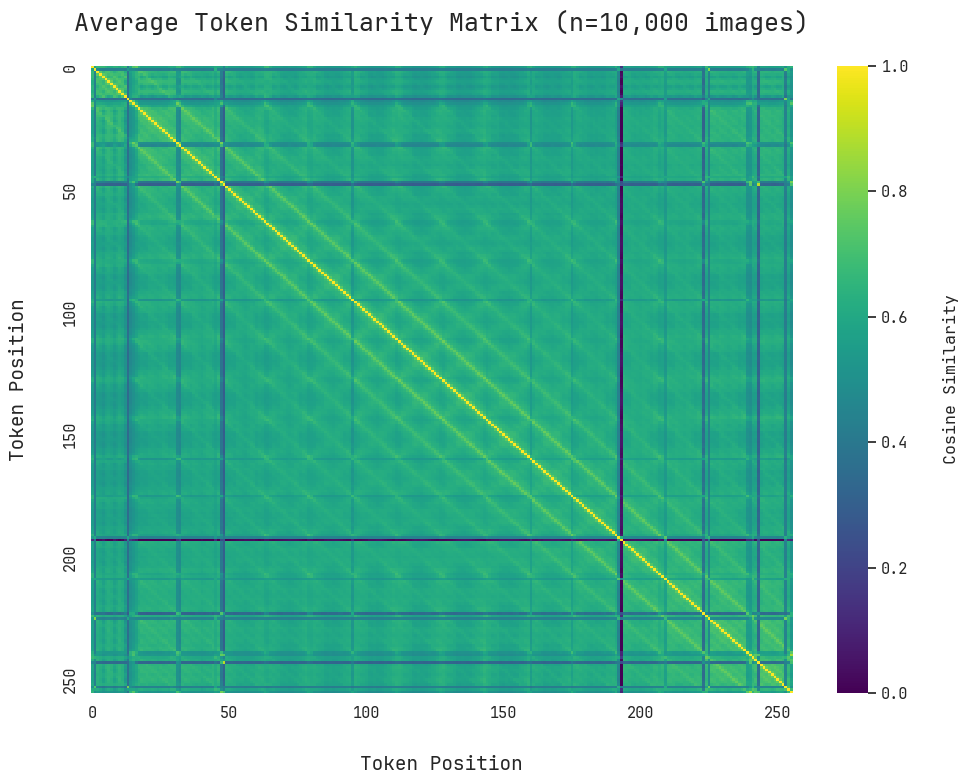
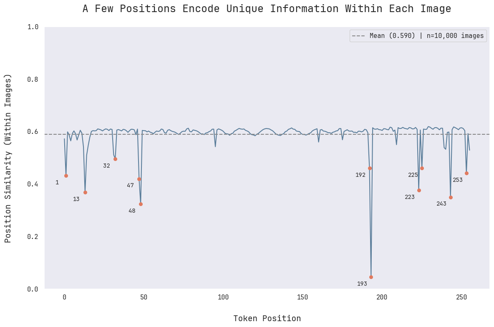
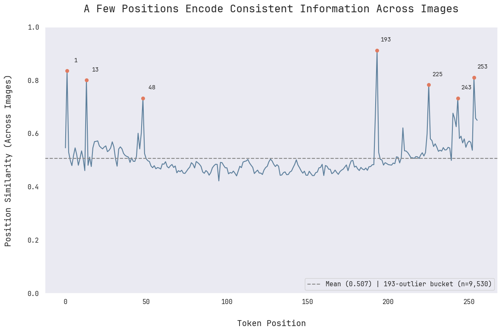

# Dissecting Vision Language Models

This repo contains frozen artifacts for my YouTube videos on VLM interpretability, plus evolving research code.

## Videos

### 1. [Dissecting Vision Language Models: How AI Sees](https://youtu.be/NpWP-hOq6II)

**Directory:** `video-1-how-ai-sees/`

Explores how VLMs work and what they actually "see" through unembedding analysis using Gemma 3. **Core Discovery**: VLMs don't truly "see" - they translate visual information into linguistic representations. They're language models that learned to speak image.

Builds on my previous video ["Dissecting GPT: The Complete Forward Pass"](https://youtu.be/z46TKDbV3No) with a mechanistic interpretability approach applied to multimodal AI.


### 2. [Dissecting Gemma 3 Image Tokenization: The Mystery of 193](https://youtu.be/3FMOknkH9XM)

**Directory:** `video-2-mystery-of-193/`

Investigates a strange pattern in Gemma 3's image tokenization: position 193 is a representational outlier in 95% of images. The research story:
1. 95% of images have position 193 as an outlier
2. This outlier is rotation-invariant (not about spatial position)
3. Position 193 embeddings are highly consistent across images (0.912 similarity)
4. Zeroing out 193 doesn't break the model, but flipping its direction does.







## research/

Ongoing research code. Free to evolve.

## Setup

You must have `uv` installed. Once you do, create the virtual environment and install dependencies with:

```bash
uv sync
```

Then navigate to a video directory and run the notebooks to reproduce the analysis.
